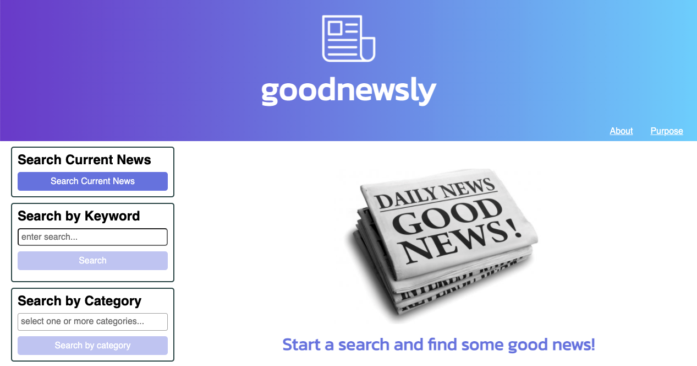

# **Week 7 & 8 Challenge**

## **Group Project: goodnewsly**

Team Members

- Mark Moore
- Tim Kuramshin
- Bryan Godwin

### **goodnewsly** - what is it?

> goodnewsly finds the good news for you
>
> More than half of Americans say that say the news causes them stress. Mental health experts say it can be damaging to read the news, because constant >exposure to negative information can impact the brain.
>
> But that’s hard to avoid when 90% of the news online, in newspapers, and on TV is negative information.
>
> But goodnewsly can help.
>
> We search the news for you, and rank the current stories with the most positive news first.
>
> goodnewsly makes it easy to find good news.

---

### **User Story**

    AS A person interested in current events and maintaining positive mental health
    I WANT to see positive news stories first when I read the news

### **Acceptance Critera**

1.  User can view current top stories

        WHEN I view top news stories
        THEN I am presented with positive stories first, neutral stories second, and negative stories third

2.  User can search for stories by category

        WHEN I select a category (eg business, entertainment, sports)
        THEN I am presented with top news stories in that category

3.  User can enter keywords to search for matching news stories

        WHEN I enter a search term
        THEN I am presented with all top stories that match that search term
        AND the search term is added to my search history

4.  User can choose a news item and read the entire news story

        WHEN I clicked on a link to a top story
        THEN I can read the entire news story

### **Group Project - code repository**

<https://github.com/godwinbw/goodnewsly>

### **Group Project - live link**

<https://godwinbw.github.io/goodnewsly/develop/>

### **Group Project - screenshot**

